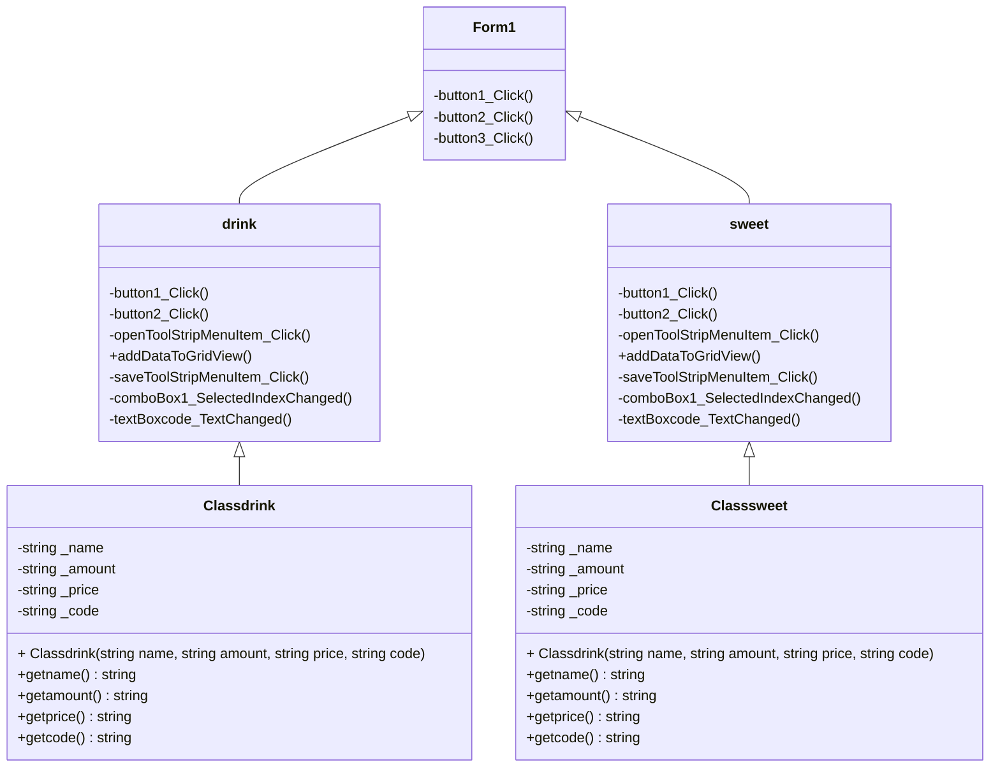

# PROJECT_4_A_PLS
## ผู้พัฒนาโปรแกรม
นางสาวภวพิชญา คำวงษา รหัสนักศึกษา 663450042-8
สาขาวิทยาการคอมพิวเตอร์และสารสนเทศ(CS) ชั้นปีที่ 1
## ความเป็นมาของโปรแกรม
 การสร้างโปรแกรมในครั้งนี้ผู้พัฒนาโปรแกรมมีความต้องการที่อยากจะพัฒนาเกี่ยวกับการซื้อขายเหมาะสำหรับคาเฟ่เพื่อที่จะคิดเงินง่ายมากขึ้นและมีการใช้ส่วนลด เนื่องจากในยุคปัจจุบันมีคาเฟ่ใหม่ๆเพิ่มมากขึ้นและการสร้างโปรแกรมนี้เป็นมีความต้องการของเจ้าของธุรกิจคาเฟ่
## วัตถุประสงค์ของโปรแกรม
1.เพื่อพัฒนาโปรแกรมเก็บข้อมูลของการขายสินค้า 2.เพื่อแก้ไขปัญหาในการลืม Order 

